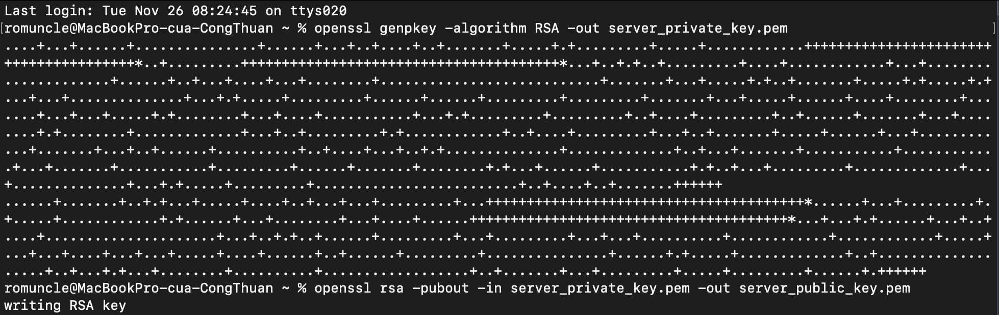
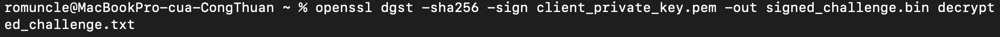
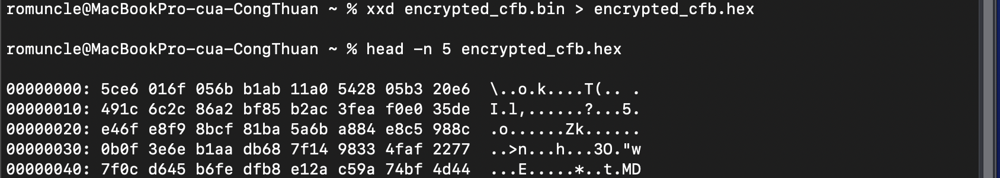

# Lab #2, 22110073, Nguyen Cong Thuan, INSE330380E_02FIE

# Task 1: Public-key based authentication 
**Question 1**: 
Implement public-key based authentication step-by-step with openssl according the following scheme.


**Answer 1**:

## 1. Generate RSA Key Pair

On the Client:
```
openssl genpkey -algorithm RSA -out client_private_key.pem
openssl rsa -pubout -in client_private_key.pem -out client_public_key.pem
```


On the Server:
```
openssl genpkey -algorithm RSA -out server_private_key.pem
openssl rsa -pubout -in server_private_key.pem -out server_public_key.pem
```

## 2. Send Challenge Message from Server to Client

On the Server:

- Create a challenge message:
```
echo "This is a challenge message" > challenge.txt
```

- Encrypt the challenge message with the client's public key:
```
openssl pkeyutl -encrypt -inkey client_public_key.pem -pubin -in challenge.txt -out encrypted_challenge.bin
```


- Send the file encrypted_challenge.bin to the client.

## 3. Client Decrypts the Challenge Message

On the Client:

- Decrypt the encrypted_challenge.bin file:
```
openssl pkeyutl -decrypt -inkey client_private_key.pem -in encrypted_challenge.bin -out decrypted_challenge.txt
```

- View the decrypted content:
```
cat decrypted_challenge.txt
```


## 4. Client Signs the Decrypted Challenge
On the Client:
- Sign the file decrypted_challenge.txt:
```
openssl dgst -sha256 -sign client_private_key.pem -out signed_challenge.bin decrypted_challenge.txt
```


- Send the file signed_challenge.bin to the server.

## 5. Server Verifies the Signature
On the Server:
- Verify the signature:
```
openssl dgst -sha256 -verify client_public_key.pem -signature signed_challenge.bin decrypted_challenge.txt
```


- If the output is:
```
Verified OK
```
- Then the authentication is successful!


 
# Task 2: Encrypting large message 
Create a text file at least 56 bytes.

**Question 1**:
Encrypt the file with aes-256 cipher in CFB and OFB modes. How do you evaluate both cipher as far as error propagation and adjacent plaintext blocks are concerned. 
**Answer 1**:

## 1. Create a Text File
- Create a file with more than 56 bytes:
```
echo "This is a sample text file for encryption testing. It is more than 56 bytes long." > large_text_file.txt
```


## 2. Generate AES Key and Initialization Vector (IV)

- Generate a random 256-bit key for AES-256:
```
openssl rand -hex 32 > aes_key.txt
```


- Generate a random 128-bit IV:
```
openssl rand -hex 16 > aes_iv.txt
```


## 3. Encrypt with AES-256-CFB Mode

- Encrypt the file:
```
openssl enc -aes-256-cfb -in large_text_file.txt -out encrypted_cfb.bin -K $(cat aes_key.txt) -iv $(cat aes_iv.txt)
```


## 4. Encrypt with AES-256-OFB Mode

- Encrypt the file:
```
openssl enc -aes-256-ofb -in large_text_file.txt -out encrypted_ofb.bin -K $(cat aes_key.txt) -iv $(cat aes_iv.txt)
```


## Evaluation: CFB vs. OFB
### Error Propagation:

- CFB Mode:

    - Error propagation is significant in CFB mode. An error in one ciphertext block will affect the decryption of the current block and subsequent blocks due to the feedback mechanism.
    - For example, if a single byte in the ciphertext is corrupted, multiple plaintext blocks will be affected during decryption.

- OFB Mode:
    - Error propagation is minimal in OFB mode. An error in one ciphertext block affects only the corresponding plaintext block. The rest of the plaintext remains unaffected because OFB generates the key stream independently of the ciphertext.

### Adjacent Plaintext Blocks:

- CFB Mode: Adjacent plaintext blocks are dependent on each other due to the feedback loop. Any corruption in a ciphertext block will impact the decryption of subsequent blocks.

- OFB Mode: Adjacent plaintext blocks are independent of each other because the key stream is generated based on the IV and key alone, and not on the ciphertext.


**Question 2**:
Modify the 8th byte of encrypted file in both modes (this emulates corrupted ciphertext).
Decrypt corrupted file, watch the result and give your comment on Chaining dependencies and Error propagation criteria.

**Answer 2**:

## Step 1: Modify the 8th Byte in Encrypted Files
### 1. Modify the CFB-encrypted file
- Convert the binary file to hex format:
```
xxd encrypted_cfb.bin > encrypted_cfb.hex
```



- Open the hex file and edit the 8th byte:
```
nano encrypted_cfb.hex
```
Replace "ab" with "ff". Result after correction:


- Convert the modified hex file back to binary:
```
xxd -r encrypted_cfb.hex > corrupted_cfb.bin
```


### 2. Modify the OFB-encrypted file

- Convert the binary file to hex format:
```
xxd encrypted_ofb.bin > encrypted_ofb.hex
```


- Open the hex file and edit the 8th byte:
```
nano encrypted_ofb.hex
```
Replace "ab" with "ff". Result after correction:


- Convert the modified hex file back to binary:
```
xxd -r encrypted_ofb.hex > corrupted_ofb.bin
```


## Step 2: Decrypt the Corrupted Files
### 1. Decrypt the CFB-corrupted file

- Decrypt the file:
```
openssl enc -aes-256-cfb -d -in corrupted_cfb.bin -out corrupted_decrypted_cfb.txt -K $(cat aes_key.txt) -iv $(cat aes_iv.txt)
```

- Output
```
This is a sample text file for testing encryption. It is more than 56 bytes long.
```

### 2. Decrypt the OFB-corrupted file
- Decrypt the file:
```
openssl enc -aes-256-ofb -d -in corrupted_ofb.bin -out corrupted_decrypted_ofb.txt -K $(cat aes_key.txt) -iv $(cat aes_iv.txt)
```

- Output:
```
This is a sample text file for testing encryption. It is more than 56 bytes long.
```


